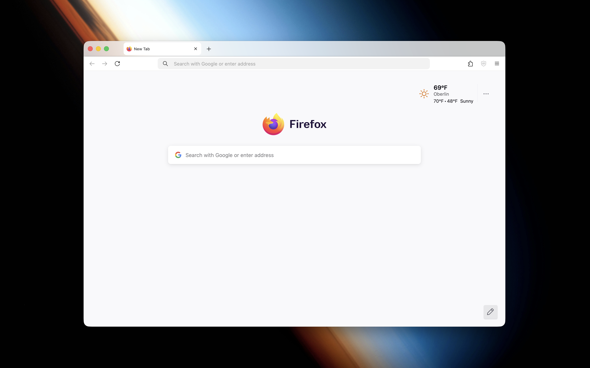

<div align=center></div>
<div align=center><h1>SensibleFox</h1></div>
<hr/>

SensibleFox is an opinionated, zero config Firefox build for MacOS ([See comparison](screenshots/comparison.md)). It's philosophy is to remove as much as possible whilst keeping all core features intact. It prioritizes speed and usability over privacy paranoia, with a focus on a clean, beautiful, and intentionally Firefox experience. All features that are removed should always be able to be turned back on. Nothing is gone or broken, but the defaults are far more usable.

## Removes:

- Telemetry & crash reports
- Studies, experiments (normandy, shield, etc)
- Mozilla promotions, sponsored content
- Cookie banners
- Tracking
- Search engines (in enterprise ver.)
- Pocket, VPN, other bloat
- New tab bloat
- Context menu bloat
- Form autofill
- Onboarding + config requirements
- AI junk

## Adds:

- uBlock Origin with all default filters turned on + ClearURLs
- Private DNS by default ('Increased' protection) - Quad9 over DoH
- 800 ish prefs from Betterfox upstream
- Global CSS for: Context menu, tab bar, etc

## Install

Download the latest `.pkg` from the [releases page](https://github.com/sensiblefox/firebuilder/releases) and install it like any other macOS application.

The installer preserves Mozilla's Firefox signature. SensibleFox does not patch `Firefox.app`; it installs supported macOS Firefox policies, uBlock managed storage, and a configured user profile. If the package is not Developer ID signed and notarized, macOS may still warn about the SensibleFox installer package itself when it was downloaded from the internet. That warning is separate from Firefox's signature.

## Build a PKG

```sh
./scripts/build-pkg.sh
```

Unsigned packages work for local testing and can usually be opened with right-click -> Open. For fully smooth Gatekeeper behavior, build with Apple Developer ID credentials:

```sh
DEVELOPER_ID_APPLICATION="Developer ID Application: Your Name (TEAMID)" \
DEVELOPER_ID_INSTALLER="Developer ID Installer: Your Name (TEAMID)" \
NOTARYTOOL_PROFILE="your-notarytool-profile" \
./scripts/build-pkg.sh
```

Set `BUNDLE_FIREFOX=1` to additionally produce `dist/SensibleFox-Offline.pkg`, a ~150 MB all-in-one package that bundles the Firefox DMG and the uBlock Origin XPI so the installer needs no network access.

```sh
BUNDLE_FIREFOX=1 ./scripts/build-pkg.sh
```

## CLI options

Running `sensiblefox` with no flags performs the exact same install the PKG does: download/verify Firefox into `/Applications`, write macOS policies, create the SensibleFox profile, install uBlock Origin, and launch Firefox.

| Flag                | Description                                                                            |
| ------------------- | -------------------------------------------------------------------------------------- |
| `-u`, `--user`      | Install Firefox to `~/Applications` (no admin prompt)                                  |
| `--no-policies`     | Skip the macOS Firefox policy plist                                                    |
| `--profile-only`    | Configure the profile without launching Firefox                                        |
| `--replace-firefox` | Reinstall Firefox even when a valid copy is already present                            |
| `--update-upstream` | Re-fetch Betterfox/arkenfox prefs into `generated/`                                    |
| `--clean`           | Interactively pick which SensibleFox profiles, policies, and managed storage to delete |


**Important**: By using this project you agree that you take legal responsibility for any actions that SensibleFox performs on your behalf during the installation process, including but not limited to disabling warnings, other legal notices, or enabling adblocking.